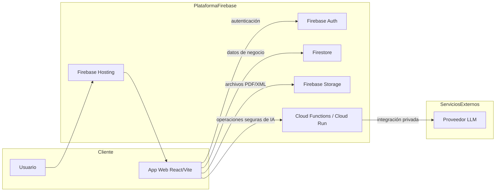
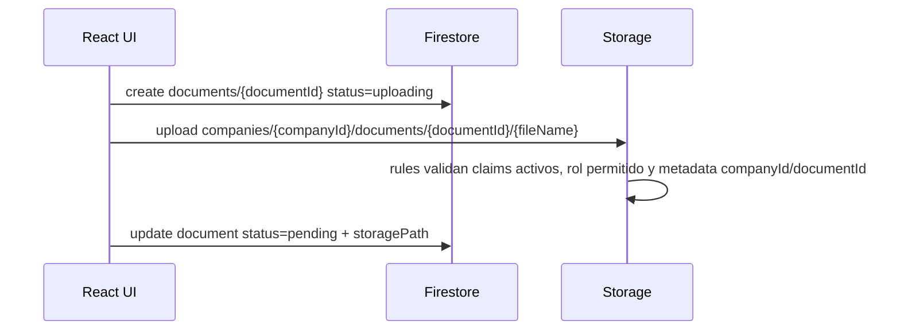

# Arquitectura final corregida




## Estructura modular incremental

> Roadmap de refactor: ver `docs/PLAN_REFACTOR_4_FASES.md` para el plan recomendado de estabilización, extracción por dominios, reorganización de capas y optimización operativa.


La estructura se corrige sin ruptura mediante fachadas estables y módulos internos nuevos:

```text
src/app/                         # `routes.jsx` y `providers.jsx`
src/features/documents/          # estados y servicios `uploadDocumentFlow` / `analyzeDocumentFlow`
src/features/companies/          # servicios de membresía, persistencia local y roles
src/infrastructure/firebase/      # repositorios, entity collections, normalización legacy y Storage documental
src/api/firebaseClient.js         # fachada pública que conserva `firebase.entities.*`
```

Reglas de migración:

- No cambiar el alias `@/*` ni las rutas públicas.
- No eliminar `src/api/firebaseClient.js`; adelgazar internamente y mantener sus exports.
- Mover lógica de UI a servicios por feature antes de reubicar páginas completas.
- Centralizar providers de negocio en `src/app/providers.jsx`, no en layouts visuales.

## Responsabilidades por carpeta (`modules`, `features`, `lib`, `shared`)

La regla general es separar **composición de aplicación**, **pantallas de negocio**, **casos de uso**, **infraestructura transversal** y **primitivas reutilizables**. Para evitar duplicidad, cada carpeta debe tener un propietario claro:

| Carpeta | Qué vive aquí | Qué no vive aquí |
| --- | --- | --- |
| `src/app/` | Composición global de React: providers, definición única de rutas, layout de rutas y wiring de alto nivel. | Lógica de negocio, llamadas directas a Firebase o componentes específicos de dominio. |
| `src/modules/` | Entrada pública de cada módulo vertical de producto: páginas/contenedores del módulo, componentes grandes acoplados a esa experiencia y fachadas legacy mientras se migra. | Servicios reutilizables de negocio, validaciones compartidas o utilidades transversales. |
| `src/features/` | Casos de uso y servicios por dominio que pueden ser consumidos por páginas, módulos o hooks: flujos documentales, membresía de compañías, roles, hooks de filtrado y constantes del dominio. | Componentes de layout global, UI genérica o adaptadores concretos de infraestructura. |
| `src/lib/` | Infraestructura transversal de la aplicación: query client, observabilidad, auditoría, utilidades base y fachadas técnicas estables. Los contextos React stateful existentes son legacy/transversales y deben migrar gradualmente a `src/app/providers` (composición) o `src/contexts` si no son infraestructura técnica pura. | Reglas de negocio específicas de un dominio si ya existe una `feature` propietaria, ni nuevos providers stateful de aplicación. |
| `src/shared/` | Contratos y piezas reutilizables sin dependencia de una feature concreta: validaciones, constantes compartidas, barrels de componentes compartidos y utilidades públicas. | Estado global, providers de aplicación o implementaciones de infraestructura. |
| `src/infrastructure/` | Adaptadores técnicos externos: Firebase Auth/Firestore/Storage/Functions, repositorios y normalización persistente. | Componentes React, decisiones de navegación o reglas visuales. |
| `src/components/` | Sistema visual y componentes reutilizables existentes, separados por familia (`ui`, `layout`, `shared`) o dominio visual legacy mientras se migra. | Casos de uso de negocio que deban poder probarse fuera de React. |
| `src/pages/` | Páginas enrutable actuales que conectan layout, componentes y servicios. A medio plazo deben adelgazarse o moverse detrás del módulo correspondiente. | Lógica persistente reutilizable o contratos de dominio. |

### Criterios prácticos de decisión

- Si el archivo define una **ruta o provider global**, vive en `src/app/`.
- Si representa una **pantalla vertical de producto** o el punto de entrada de un módulo, vive en `src/modules/<dominio>/` o temporalmente en `src/pages/` hasta completar la migración.
- Si implementa un **caso de uso de negocio reusable** (`uploadDocumentFlow`, membresía, roles, filtros de dominio), vive en `src/features/<dominio>/`. Debe poder probarse sin montar UI ni depender de una ruta concreta.
- Si es una **capacidad transversal técnica** (`observability`, `query-client`, logger), vive en `src/lib/`. Si es un contexto React stateful, preferir `src/app/providers` para composición global o `src/contexts` para estado transversal compartido.
- Si es una **pieza reusable sin dueño de dominio** (schemas, constantes compartidas, componentes compartidos), vive en `src/shared/`.
- Si habla con un **servicio externo o persistencia**, vive en `src/infrastructure/` y se consume mediante fachadas/servicios, no directamente desde UI nueva.
- Si hay un nombre de dominio duplicado entre `src/modules/<dominio>` y `src/features/<dominio>`, usar este criterio decisorio: ¿es un componente visual acoplado a una ruta o experiencia? → `src/modules`; ¿es lógica de negocio testeable sin UI? → `src/features`; ¿se reutiliza desde varios dominios sin dueño claro? → `src/shared` o `src/infrastructure` según sea contrato puro o adaptador técnico.


## Seguridad de configuración runtime y endpoints

`src/main.jsx` puede solicitar `/app-config.js` para permitir configuración runtime en despliegues estáticos, pero ese archivo no debe insertarse como `<script>` ni ejecutarse con `eval`/`Function`. La carga aprobada es: descargar el texto, parsearlo con `src/config/runtimeConfig.js`, aceptar solo JSON o asignaciones literales de las llaves permitidas (`GEMAILLA_FIREBASE_CONFIG`, `GEMAILLA_USE_FIREBASE_EMULATORS`, `GEMAILLA_RELEASE`) y descartar cualquier código no permitido. Este patrón reduce el riesgo de XSS asociado a ejecutar configuración remota como JavaScript arbitrario.

Las llamadas de IA y funciones internas deben conservar integración segura y same-origin: `src/api/firebaseClient.js` usa rutas relativas fijas (`/api/ai` y `/api/functions`) que Firebase Hosting gestiona de forma segura bajo el mismo origen. No existen endpoints configurables desde el navegador para estos servicios; si se necesita un proveedor externo, debe exponerse detrás de Cloud Functions/Cloud Run y mantenerse accesible mediante las rutas internas de Hosting.

## Validaciones tempranas en flujos

Todos los flujos en `src/features` deben validar precondiciones (`company.id`, `companyId`, `storagePath`, permisos mínimos y parámetros obligatorios) **antes** de cualquier operación de estado (`update`, `set`, creación de documentos, mutaciones optimistas o subida a Storage). Las validaciones tempranas evitan estados parciales, archivos huérfanos y auditoría inconsistente; cuando fallen, el flujo debe abortar con un error explícito antes de tocar persistencia o estado de UI.


## Principios de arquitectura

### 1. Firebase como backend primario

- La app es estática y se despliega en Firebase Hosting.
- Firebase Auth identifica al usuario.
- Firestore guarda metadata y entidades de negocio.
- Storage guarda binarios PDF/XML.
- Las reglas de Firestore/Storage son parte crítica de la arquitectura, no una capa secundaria.

### 2. Multiempresa por membresía y roles

Las colecciones de negocio usan `companyId` y se protegen mediante:

- dueño de empresa (`companies/{companyId}.ownerUid`),
- membresía activa (`companyMembers/{companyId}_{uid}`),
- roles permitidos para escritura (`owner`, `director`, `admin`, `editor`).

### 3. Flujo documental sin archivos huérfanos

El flujo corregido es:



Decisiones:

- Firestore se crea antes de Storage para mantener el contrato de negocio; Storage no lee Firestore y valida aislamiento con claims activos y metadata personalizada `companyId`/`documentId`.
- Storage acepta solo `create`; no acepta `update` ni `delete` desde cliente.
- La app guarda `storagePath`, no URLs públicas persistidas.
- Si falla la subida, la metadata queda marcada con `status: "error"` y `errorMessage`.

### 4. IA segura por backend

La app no llama proveedores LLM con claves privadas desde el navegador. Si se requiere IA real:

1. React envía la petición a Cloud Functions o Cloud Run.
2. El backend valida Firebase Auth ID Token.
3. El backend valida `companyId`, rol y cuota.
4. El backend obtiene documentos desde Storage si corresponde.
5. El backend llama al proveedor LLM.
6. El backend guarda auditoría y devuelve una respuesta controlada.

Sin backend configurado, la IA queda degradada con mensaje claro en la interfaz.

## Colecciones principales

```text
users/{uid}
companies/{companyId}
companyMembers/{companyId}_{uid}
documents/{documentId}
auditLogs/{logId}
transactions/{id}
subscriptions/{id}
predictionLogs/{id}
aiConversations/{id}
```

## Storage

```text
companies/{companyId}/documents/{documentId}/{fileName}
```

Condiciones principales:

- usuario autenticado;
- permiso de lectura/escritura sobre la empresa;
- metadata `companyId`/`documentId` coincidente con la ruta y claim de empresa activo;
- archivo PDF/XML;
- tamaño máximo 15 MB;
- archivo inmutable después de creado.
