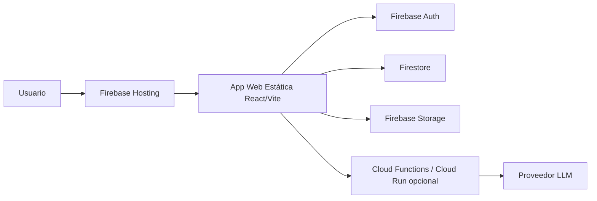
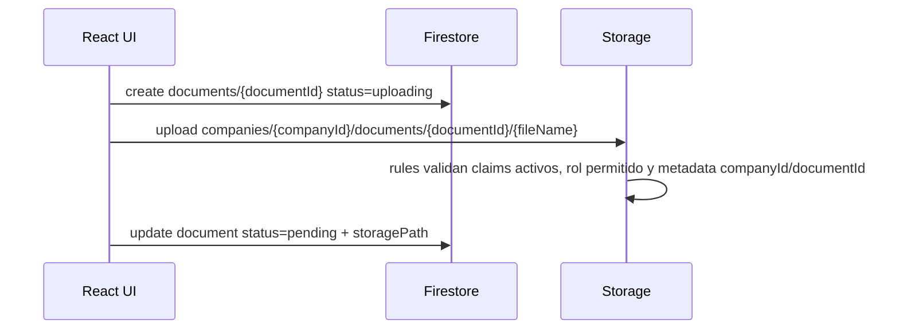

# Arquitectura final corregida




## Estructura modular incremental

La estructura se corrige sin ruptura mediante fachadas estables y módulos internos nuevos:

```text
src/app/                         # `routes.jsx` y `providers.jsx`
src/features/documents/          # estados y servicios `uploadDocumentFlow` / `analyzeDocumentFlow`
src/features/companies/          # servicios de membresía, persistencia local y roles
src/infrastructure/firebase/      # repositorios, entity collections, normalización legacy y Storage documental
src/api/firebaseClient.js         # fachada pública que conserva `firebase.entities.*`
```

Reglas de migración:

- No cambiar el alias `@/*` ni las rutas públicas.
- No eliminar `src/api/firebaseClient.js`; adelgazar internamente y mantener sus exports.
- Mover lógica de UI a servicios por feature antes de reubicar páginas completas.
- Centralizar providers de negocio en `src/app/providers.jsx`, no en layouts visuales.

## Principios de arquitectura

### 1. Firebase como backend primario

- La app es estática y se despliega en Firebase Hosting.
- Firebase Auth identifica al usuario.
- Firestore guarda metadata y entidades de negocio.
- Storage guarda binarios PDF/XML.
- Las reglas de Firestore/Storage son parte crítica de la arquitectura, no una capa secundaria.

### 2. Multiempresa por membresía y roles

Las colecciones de negocio usan `companyId` y se protegen mediante:

- dueño de empresa (`companies/{companyId}.ownerUid`),
- membresía activa (`companyMembers/{companyId}_{uid}`),
- roles permitidos para escritura (`owner`, `director`, `admin`, `editor`).

### 3. Flujo documental sin archivos huérfanos

El flujo corregido es:



Decisiones:

- Firestore se crea antes de Storage para mantener el contrato de negocio; Storage no lee Firestore y valida aislamiento con claims activos y metadata personalizada `companyId`/`documentId`.
- Storage acepta solo `create`; no acepta `update` ni `delete` desde cliente.
- La app guarda `storagePath`, no URLs públicas persistidas.
- Si falla la subida, la metadata queda marcada con `status: "error"` y `errorMessage`.

### 4. IA segura por backend

La app no llama proveedores LLM con claves privadas desde el navegador. Si se requiere IA real:

1. React envía la petición a Cloud Functions o Cloud Run.
2. El backend valida Firebase Auth ID Token.
3. El backend valida `companyId`, rol y cuota.
4. El backend obtiene documentos desde Storage si corresponde.
5. El backend llama al proveedor LLM.
6. El backend guarda auditoría y devuelve una respuesta controlada.

Sin backend configurado, la IA queda degradada con mensaje claro en la interfaz.

## Colecciones principales

```text
users/{uid}
companies/{companyId}
companyMembers/{companyId}_{uid}
documents/{documentId}
auditLogs/{logId}
transactions/{id}
subscriptions/{id}
predictionLogs/{id}
aiConversations/{id}
```

## Storage

```text
companies/{companyId}/documents/{documentId}/{fileName}
```

Condiciones principales:

- usuario autenticado;
- permiso de lectura/escritura sobre la empresa;
- documento Firestore existente y asociado a la misma empresa;
- archivo PDF/XML;
- tamaño máximo 15 MB;
- archivo inmutable después de creado.
